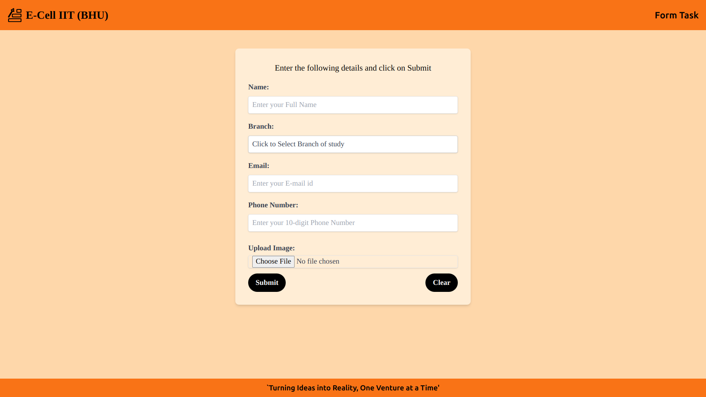

# Project Description

This project is a web application developed for handling form submissions from participants with E-cell design based UI. It provides a user-friendly web interface for participants to submit their details including their name, branch of study, email, phone number along with an optional image upload. The submitted data is then stored in a Firebase Firestore database organized into collections, and images are uploaded to Firebase Storage. The Form is fully responsive and can be rendered across all devices. On submitting the form, the user access to Firebase database can access the form data.

## Techs Used

- *React(Vite)* : The frontend(client-side) of the application is built using React, a popular JavaScript library for building user interfaces. Vite provides a fast and optimized development server

- *react-hook-form* : Used for form handling and validation in React.

- *Firebase* : A platform used to mobile and web applications. Firebase services used in this project include Firestore for the database and Storage for file uploads.

- *ES6 JavaScript* : Using modern JavaScript syntax and features for cleaner maintainable code

- *Tailwind CSS* : A utility-first CSS framework used for styling the UI components.

- *Git* : Version control system used for managing the source code.

## Firebase Implementation

- I have used Firebase Firestore database and Firebase Storage ,configured with Firebase SDK. I have used my own Firebase configuration by creating a project named "E-cell Form Task" in firebase console. 
- You can check the implementation in your firebase project by changing the config file in [firebase.js](./src/firebase.js)

- You can watch the recording of the working of the firebase setup in storing the form data at Database and storage
  [Recording](https://drive.google.com/file/d/1EJN-wv6sAjYDM8iC6qB3TX63eN_rXYKt/view?usp=sharing)

## Form page Screenshot

- 

## Form Deployed Site link
-- Access my Form-Project here [Click](https://tech-team-expansion-task-2024-five.vercel.app/)