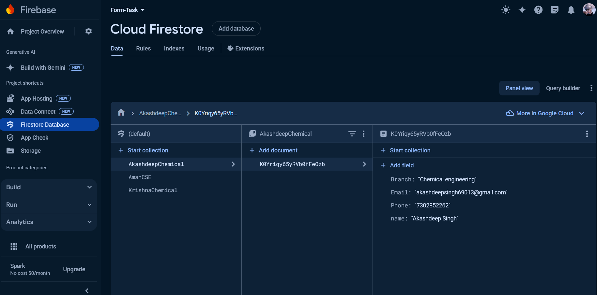
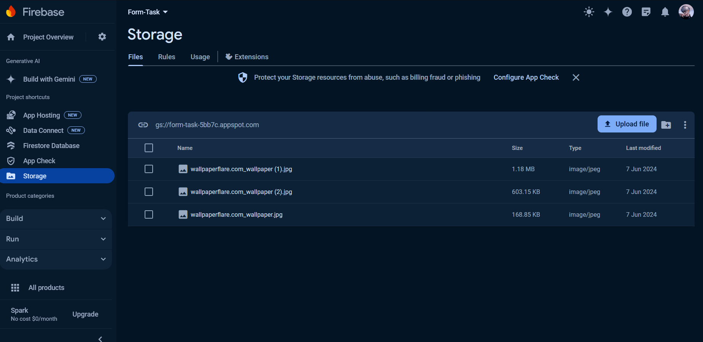
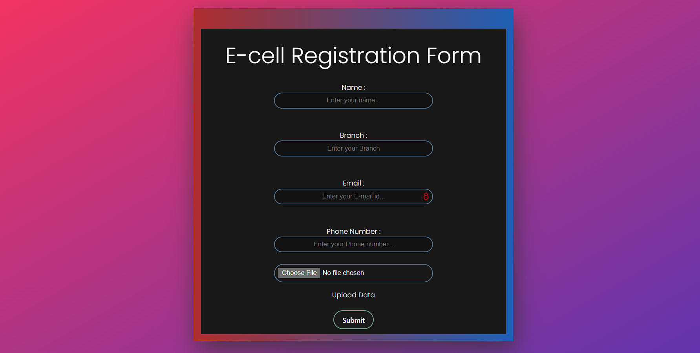

# Project Description

This project is a react app  which is created to register details of Students.This form stores the name,phone number, email id and branch of that student.This data of students is stored using firebase firestore. The data is stored in the firestore in the form of a collection named with their starting name and branch combined. The data is stored in the form of documents in the collection.Ihave used React-Hook-Form to validate the fields in making the form.This form is fully responsive and I have also done the bonus task.

## Technologies Used
- React
- Firebase
- Firestore
- Vite
- Typescript
- Git
- React-Hook-Form

## Firebase
- I have used my own Firebase configuration by creating a project named "Form-Task" in firebase console. 
- You can check the implementation in your firebase project by changing the config file in [firebase.tsx](./src/firebase.tsx)

- Here is the vido link of the working of the app and the firestore database.
  [Video](https://drive.google.com/file/d/1-srO7vc-TEzKO6y2ToP2eWaUf_wlq3U0/view?usp=sharing)

- here is the screenshot of the firestore database collections.
  
- here is the screenshot of the firestore image data
  
- here is the screenshot of the app.
    

## Form site link
- Link: [Form](https://tech-team-expansion-form-task-2024.vercel.app/)
- firebase console link : [Firebase Console](https://console.firebase.google.com/project/form-task-5bb7c/overview)
